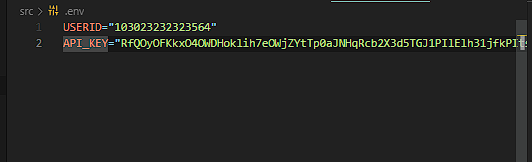

# aliceBlue

A JS SDK for Alice Blue API

* Create a .env file which include API_KEY and USERID in it , which are further required for Alice Blue API Access, To Get the api key login to alice blue dashboard [Click Here](https://ant.aliceblueonline.com/apps "Alice Blue Login")

  2. follow this step's after getting the api key and userid your .env file should look like this  👇



3. import your api key and user id in the root file also don't forget to import our Alice Class you can do that by

   ```bash
   npm i @kalilinuxuser5/aliceblue
   ```

   ```bash


   ```javascript
   const Alice = require("@kalilinuxuser5/aliceblue/src/aliceBase")
   require('dotenv').config()
   let apiKey = process.env.API_KEY
   let userId = process.env.USERID
   ```

   or you can use it directly

```javascript
const Alice = require("@kalilinuxuser5/aliceblue/src/aliceBase")
require("dotenv").config()

const main = async () => {
  
    let alice = new Alice(process.env.USERID, process.env.API_KEY)
    await alice.apiEncryptionKey()
    await alice.getSessionId()
    let positionBook = await alice.positionBook()
    console.log(positionBook)
}

main()


```

alice.apiEncryptionKey()

The Above Method is used to get encryption key from alice server

alice.getSessionId ()

This Above Method is required for getting Session token from alice server which are further required for all authorized endpoint

```javascript


const Alice = require("@kalilinuxuser5/aliceblue/src/aliceBase")
require("dotenv").config()
const log = console.log

const main = async () => {

     let alice = new Alice(process.env.USERID, process.env.API_KEY)
    console.log(alice)
    let encryptionKey = await alice.apiEncryptionKey()
    log("enc key", encryptionKey)
    let sessionId = await alice.getSessionId()
    log("session id", sessionId)
    let orderBook = await alice.positionBook()
    log("order Book", orderBook)
    let holding = await alice.holdings()
    log("Holding", holding)
    let funds = await alice.getFunds()
    log("Funds", funds)
    let profile = await alice.getProfile()
    log("Funds", profile)
    let wsSession = await alice.getWSSession()
    log("Ws Session", wsSession)
    let wSocket = await alice.WebSocket()
    let searchScript = await alice.searchScrip("tcs")
    log("Search Script",searchScript)
    let watchList = await alice.watchList()
    log("watch list",watchList)
    let placeOrder = await alice.placeOrder()
    log("place order", placeOrder)
    let square_off = await alice.squareOff()
    log("square off", square_off)   
    let tradeBook = await alice.tradeBook()
    log("trade book", tradeBook)
    let modifyOrder = await alice.modifyOrder(transtype = "B", nestOrderNumber = 230915000171647)
    log("modify order", modifyOrder)
    let cancelOrder = await alice.cancelOrder(nestOrderNumber = 230915000171647)
    log("modify order", cancelOrder)
    let orderHistory = await alice.orderHistory(nestOrderNumber = 230915000171647)
    log("modify order", orderHistory)

}

main()


```

what's next after this 🤔

don't worry , we are working on it for adding more better support and better features in near future , Stay Tuned For More Updates 😎⭐

Fell Free To Contact me 🤙 👇

[Website](https://shubhyadav.tech "Website")

[LinkedIn](https://www.linkedin.com/in/shubhsinghyadav/ "LinkedIn")

[Medium](https://medium.com/@kalilinuxuser5 "Medium")

[Instagram](https://www.instagram.com/shubham.yadav_5/ "Instagram")
